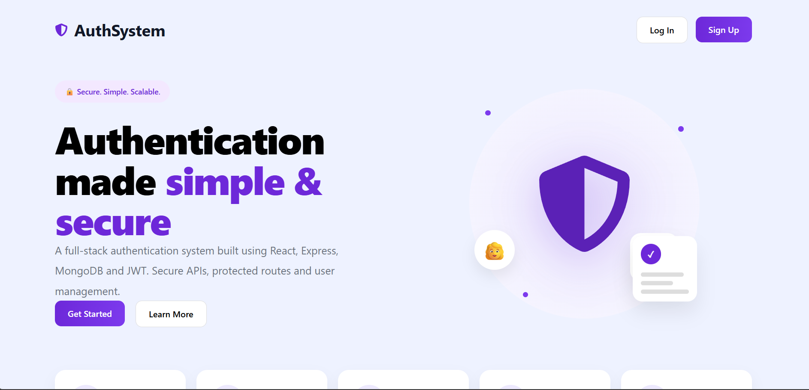
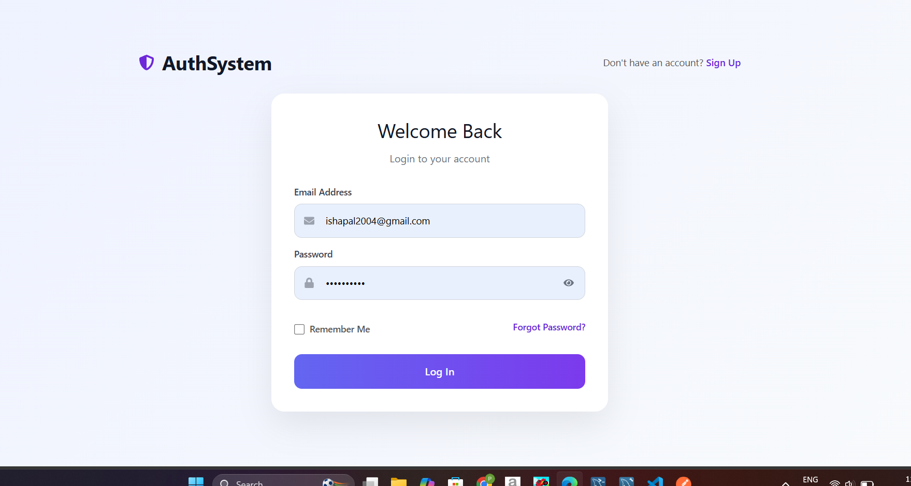
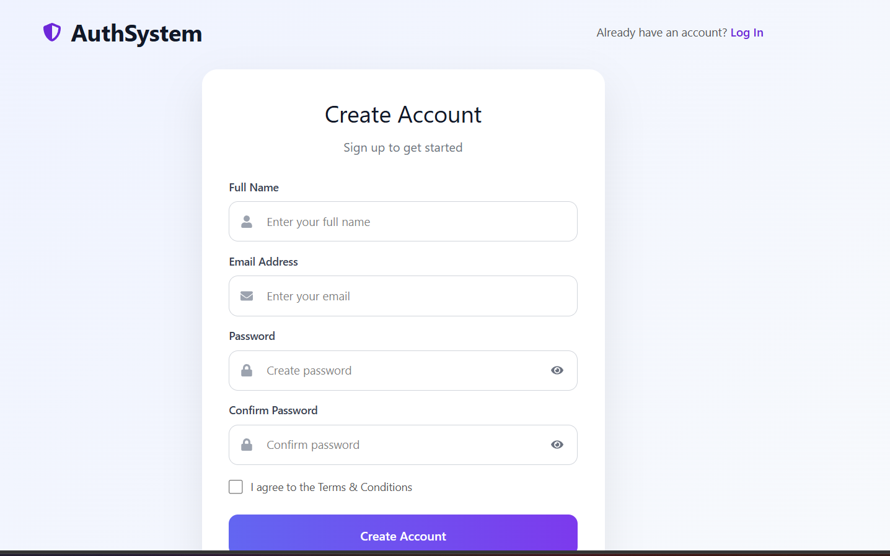
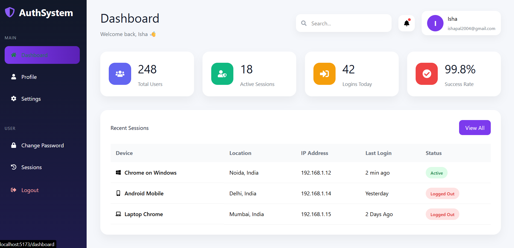
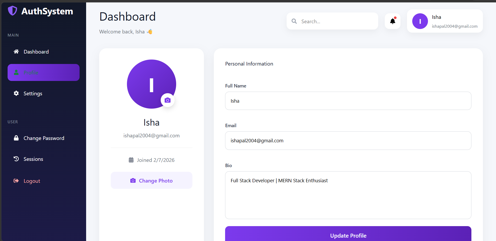
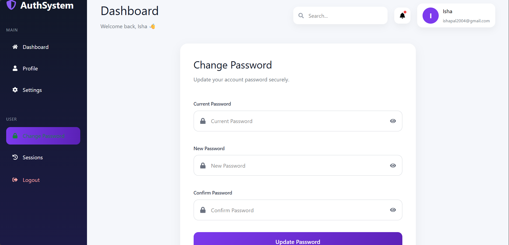

<div align="center">

# 🔐 Full-Stack Authentication System

### Secure MERN Authentication with JWT, Refresh Tokens & User Dashboard


A modern authentication system built using the **MERN Stack** featuring JWT Authentication, Refresh Tokens, Protected Routes, Profile Management, and a responsive Dashboard.

</div>

---

# 📖 Overview

This project demonstrates a complete authentication workflow for modern web applications.

It includes secure user authentication, profile management, refresh token implementation, protected routes, password encryption, and a clean dashboard interface.

The project follows a modular architecture using React for the frontend and Node.js + Express with MongoDB for the backend.

---

# ✨ Features

## 🔑 Authentication

- User Registration
- User Login
- JWT Access Token Authentication
- Refresh Token Authentication
- Secure Logout
- Password Hashing using bcrypt
- Protected Frontend Routes
- Protected Backend APIs

---

## 👤 User Management

- View Profile
- Update Profile
- Change Password
- User Dashboard

---

## 📊 Dashboard

- Modern Dashboard UI
- Sidebar Navigation
- Header Section
- Statistics Cards
- Recent Login Sessions

---

## 🎨 Frontend

- Responsive Landing Page
- Modern Login UI
- Modern Register UI
- React Router Navigation
- Axios API Integration
- Responsive Layout

---

## ⚙ Backend

- Express REST APIs
- MongoDB Database
- Mongoose ODM
- JWT Authentication
- Refresh Token API
- Authentication Middleware

---

# 🛠 Tech Stack

## Frontend

- React.js
- React Router DOM
- Axios
- React Icons
- CSS3

---

## Backend

- Node.js
- Express.js
- MongoDB
- Mongoose
- JWT
- bcryptjs
- dotenv
- cors

---

# 📂 Folder Structure

```text
Auth-System
│
├── client
│   ├── src
│   │
│   ├── components
│   ├── pages
│   ├── services
│   ├── App.jsx
│   └── main.jsx
│
├── server
│   ├── config
│   ├── controllers
│   ├── middleware
│   ├── models
│   ├── routes
│   ├── server.js
│   └── .env
│
└── README.md
```

---

# 🔒 Authentication Workflow

```text
Landing Page
      │
      ▼
User Registration
      │
      ▼
User Login
      │
      ▼
JWT Access Token
      │
Refresh Token
      │
      ▼
Protected Routes
      │
      ▼
Dashboard
      │
      ▼
Profile Management
      │
      ▼
Change Password
      │
      ▼
Logout
```

---

# 📡 REST API

| Method | Endpoint | Description |
|---------|----------|-------------|
| POST | `/api/auth/register` | Register User |
| POST | `/api/auth/login` | Login User |
| GET | `/api/auth/profile` | Get User Profile |
| PUT | `/api/auth/profile` | Update Profile |
| PUT | `/api/auth/change-password` | Change Password |
| POST | `/api/auth/refresh-token` | Generate New Access Token |

---

# 📸 Screenshots

## 🏠 Landing Page



---

## 🔑 Login & Register

<p align="center">





</p>

---

## 📊 Dashboard

<p align="center">



</p>

---

## 👤 Profile

<p align="center">



</p>

---

## 🔒 Change Password

<p align="center">



</p>

---

# 🚀 Installation

## Clone Repository

```bash
git clone https://github.com/Isha4002/Auth-System.git
```

---

## Backend

```bash
cd server

npm install
```

Create a `.env` file

```env
PORT=5000

MONGO_URI=YOUR_MONGODB_CONNECTION_STRING

JWT_SECRET=YOUR_ACCESS_TOKEN_SECRET

JWT_REFRESH_SECRET=YOUR_REFRESH_TOKEN_SECRET
```

Run Server

```bash
npm run dev
```

---

## Frontend

```bash
cd client

npm install

npm run dev
```

---

# 🔐 Security Features

- JWT Authentication
- Refresh Token Authentication
- Password Hashing (bcrypt)
- Protected API Routes
- Protected React Routes
- Authentication Middleware
- Automatic Token Refresh using Axios Interceptors

---

# 🌱 Future Enhancements

- Forgot Password (OTP)
- Email Verification
- Profile Picture Upload
- Login Activity
- Dashboard Analytics
- Dark Mode
- Two-Factor Authentication (2FA)

---

# 📚 Learning Outcomes

Through this project I gained practical experience with:

- MERN Stack Development
- REST API Design
- JWT Authentication
- Refresh Token Workflow
- MongoDB & Mongoose
- Express Middleware
- React Router
- Axios Interceptors
- User Session Management
- Secure Password Storage
- Protected Routing

---

# 👩‍💻 Author

## **Isha Pal**

📧 **Email:** ishapal2004@gmail.com

💻 **GitHub:** https://github.com/Isha4002

🔗 **LinkedIn:** https://www.linkedin.com/in/isha-pal-76724a2a4/

---

<div align="center">

### ⭐ If you like this project, consider giving it a star!

Made with ❤️ using the MERN Stack

</div>
